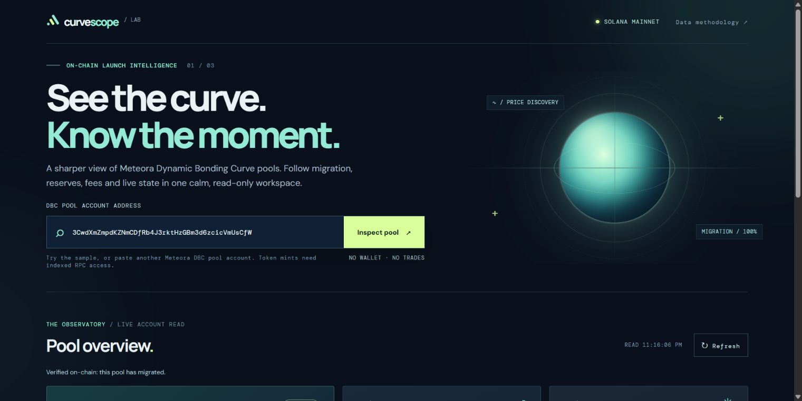

# CurveScope

**See the curve. Know the moment.** CurveScope is a read-only observatory for [Meteora Dynamic Bonding Curve](https://docs.meteora.ag/developer-guides/dbc) pools on Solana mainnet.

[Open the live demo](https://curvescope-orbit-2026.navy-coin-0045.chatgpt.site/) · [View the Colosseum project](https://colosseum.com/arena/projects/curvescope) · [View the pitch deck](CurveScope-pitch.pptx)



## What it does

Enter a Meteora DBC **pool account** to inspect its live state, migration progress, base and quote reserves, configured fee reference, and last bonding-curve price. The dashboard links to the underlying Solana accounts and exports the observed data as JSON.

CurveScope distinguishes the final DBC price of a migrated pool from a current market price. It never connects a wallet, signs a transaction, quotes an executable trade, or takes custody of funds.

## Run locally

Requires Node.js and network access to Solana mainnet.

```bash
npm install
npm start
```

Open the local URL printed by the server. The included sample is a migrated DBC pool; paste another DBC pool account to inspect it. No API key is needed.

## How it works

- The local Node server and edge Worker use the official `@meteora-ag/dynamic-bonding-curve-sdk` and `@solana/web3.js` to decode Solana mainnet accounts.
- PublicNode provides keyless Solana RPC access. Pool-account inspection works; token-mint search requires indexed RPC and is not available on this endpoint.
- The browser renders the read-only result, its source links, and an optional JSON export.
- Public RPC availability and rate limits can cause temporary errors. The last inspection is cached for 30 seconds.

Build the edge bundle with `npm run build`. Its output is generated in `dist/` and is not committed.

### Static Miqayel build

Run `npm run build:miqayel` to create `miqayel/dist/curvescope.html`. Upload this single HTML file in the Miqayel Platform website editor. It bundles the app and the browser-side Meteora pool reader, so the static site does not need a Node server. The reader calls PublicNode directly from each visitor's browser; public RPC availability can cause temporary errors.

## Hackathon entry

Built for the Crypto World's Fair hackathon and the Meteora DBC side track. The live demo shows the current prototype. Prize eligibility and judging are controlled by the organizers; publishing this repository does not constitute a final submission or guarantee a prize.

